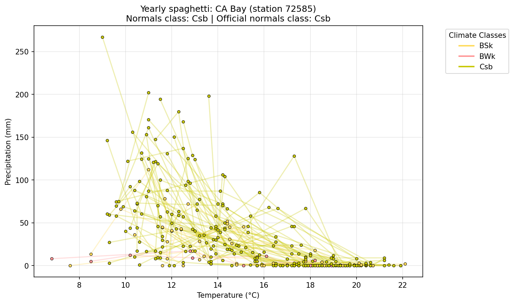
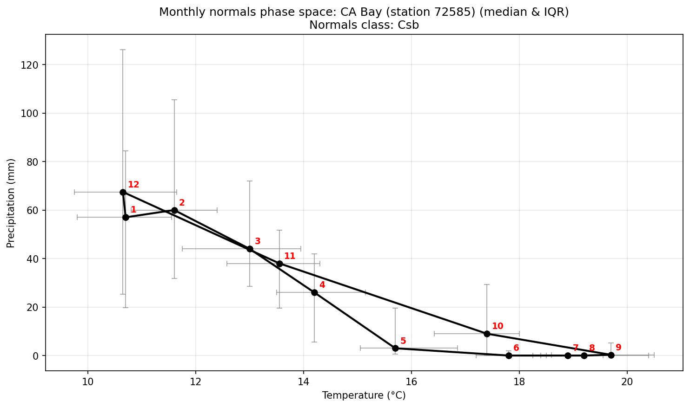

# Meteorology Phase Space

Temperature–precipitation phase-space trajectories versus monthly normals and yearly Köppen classification, backed by Meteostat.

## Install

From the repo root:

```bash
pip install -e .

# optional dev tooling
pip install -e ".[dev]"
```

This installs the **`meteo_phase_space`** library and exposes the **`meteo-phase-space`** console command.

## Data

Meteorology is sourced from Meteostat (see [https://dev.meteostat.net/python](https://dev.meteostat.net/python)).

Köppen logic is adapted from the [`salvah22/koppenclassification`](https://github.com/salvah22/koppenclassification) repository. Specifically, the focus here is to vectorize all the code for speed with `numpy`.

## CLI (Tyro)

The CLI has two **subcommands**: **`station`** (known Meteostat id) and **`coords`** (nearest station to latitude/longitude; the geographically closest row from `stations.nearby` is used).

Plot files are written only when **`--save-plots`** is set. **`--plots-dir`** defaults to **`generated_plots`** (git‑ignored ephemeral output); override it (for example **`--plots-dir examples_plots`**) when you want figures under another root. Figures are grouped under **`{plots_dir}/{slug(display_name)}/`** with DPI and `bbox_inches="tight"` applied via `save_figure`. Omitting both **`--save-plots`** and **`--show`** skips figure generation while still fetching data and printing summary logs (**`INFO`**; use **`--verbose`** for debug). Per‑figure toggles are booleans named `should_plot_*` in code; Tyro exposes them as **`--should-plot-…`** with shorter aliases (**`--plot-spaghetti`**, **`--plot-normals-sd`**, **`--plot-normals-iqr`**, **`--plot-koppen-frequency`**).

Examples:

```bash
# Known station id + readable label → default generated_plots/denver_co/…
meteo-phase-space station --station-id 72585 --name "CA Bay" --start-year 1990 --end-year 2025 --save-plots

# Same, but committed examples layout
meteo-phase-space station --station-id 72585 --name "CA Bay" --start-year 1990 --end-year 2025 --save-plots --plots-dir examples_plots

# Nearest station to coordinates + label
meteo-phase-space coords --lat 39.7392 --lon -104.9903 --name "Denver, CO" --save-plots --plots-dir examples_plots

# Interactive windows only (after building figures)
meteo-phase-space station --station-id 72585 --show
```

Output filenames include `spaghetti.png` (each year is plotted), `normals_standard_deviation.png`, `normals_quantile.png`, and `koppen_frequency.png`.

Spaghetti plot:


Normals plot:


## Python API

```python
from meteo_phase_space import (
    fetch_and_classify_station,
    nearest_station_id,
    plot_phase_space,
    plot_koppen_frequency,
    save_figure,
    plots_subdir,
)

sid = nearest_station_id(40.015, -105.271)
result = fetch_and_classify_station(sid, 1990, 2025, display_name="Boulder, CO")
if result:
    fig = plot_phase_space(result, mode="spaghetti")
    save_figure(fig, plots_subdir("examples_plots", result["display_name"]) / "spaghetti.png")
```

## Repository Layout

- `src/meteo_phase_space/koppen.py` — Köppen colors + vectorized classifier
- `src/meteo_phase_space/meteo_query.py` — Meteostat fetch and classification payloads
- `src/meteo_phase_space/plot_phase_space.py` — figures + `save_figure`
- `src/meteo_phase_space/plot_paths.py` — slug and per-location subdirectory paths
- `src/meteo_phase_space/cli.py` — Tyro CLI entrypoint

## License

This code is provided under MIT License, but I would appreciate if you cite the repository when used. Please also report any bugs when found.
